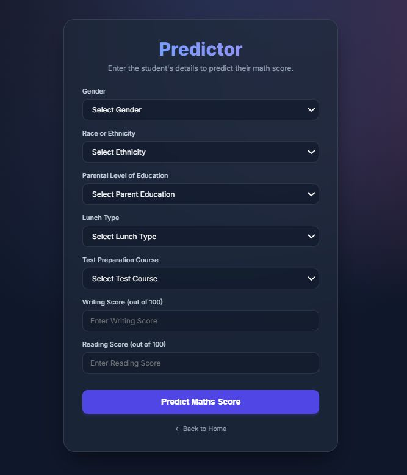

  

# Student Performance Prediction

A Machine Learning web application that predicts a student's math score based on their demographic information and academic background.

## 🌟 Overview

This project uses a trained machine learning model to forecast academic success. Users can input a student's gender, ethnicity, parental education level, lunch type, and test preparation course status to receive an instant score prediction. 

The application features a modern, glassmorphic UI and is fully integrated with a CI/CD pipeline for automated deployment to Azure App Service.

## 🚀 Technologies Used

- **Backend:** Python, Flask, Gunicorn
- **Machine Learning:** Scikit-Learn, CatBoost, XGBoost, Pandas, Numpy
- **Frontend:** HTML5, CSS3 (Custom Glassmorphism UI)
- **Deployment:** Azure App Service (Linux), GitHub Actions (CI/CD)

## 📊 Dataset

**Source:** [Students Performance in Exams (Kaggle)](https://www.kaggle.com/datasets/spscientist/students-performance-in-exams/data)

### Feature Details
- **gender**: Gender of the student (male/female)
- **race/ethnicity**: Ethnicity group of the student (Group A, B, C, D, E)
- **parental level of education**: Highest education level of the student's parents (e.g., bachelor's degree, some college, master's degree, associate's degree, high school, some high school)
- **lunch**: Type of lunch the student receives (standard or free/reduced)
- **test preparation course**: Indicates whether the student completed a test preparation course before the exams (none or completed)
- **math score**: Score obtained in the math exam (0-100)
- **reading score**: Score obtained in the reading exam (0-100)
- **writing score**: Score obtained in the writing exam (0-100)
